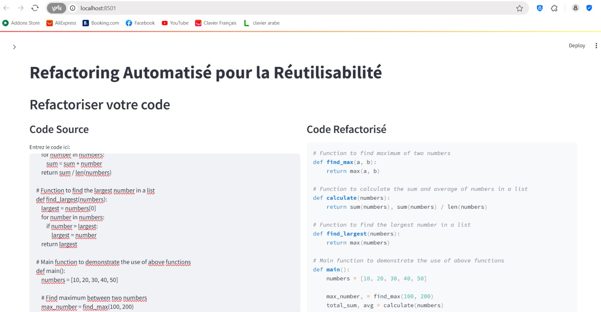
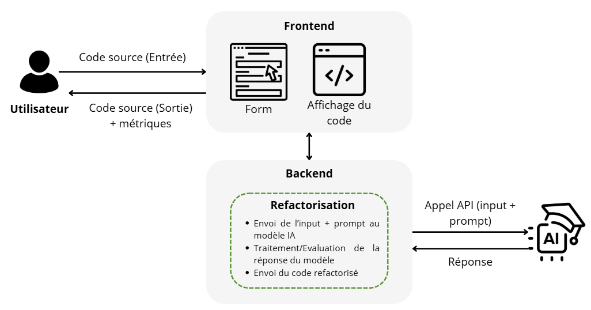
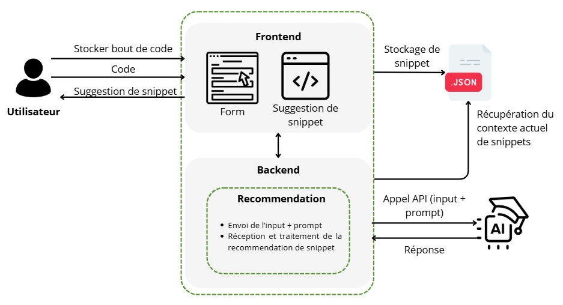
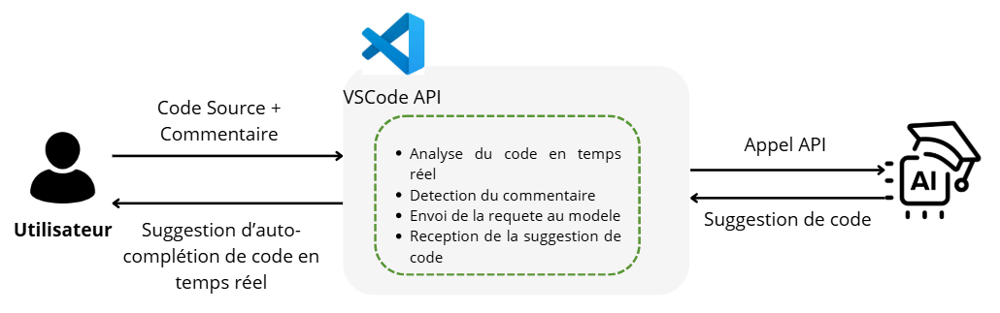

# AI for software reuse

The goal of this project is to exploit AI in the context of software reuse or code reuse.

## Overview

<p align="center">
    
    
</p>

## Table of content

- [Architecture](#architecture)
    - [Streamlit app](#streamlit-app)
    - [Auto-completion extension](#auto-completion-extension)
- [Requirements](#requirements)
- [How to try out the app](#how-to-try-out-the-app)
- [Contributors](#contributors)

## Architecture

### Streamlit app

<p align="center">
    
    
</p>

### Auto-completion extension

<p align="center">
    
</p>

## Requirements

Add the API keys for:
- groqCloud
- OpenAI's GPT-4 or 3.5

In a config.json file.

## How to try out the app

To execute the app, run the following commands:

1. Create a virtual environment:
```
python -m venv venv
```
2. Activate the virtual environment:
```
.\venv\Scripts\activate
```

3. Install dependencies
```
pip install -r requirements.txt
```

4. Run the Streamlit app
```
streamlit run streamlit_app/app.py
```

5. When done, deactivate the virtual environment
```
deactivate
```

## Contributors
- [@Cristal32](https://github.com/Cristal32)
- [@lamAz19](https://github.com/lamAz19)
- [@SalmaElAdes](https://github.com/SalmaElAdes)
